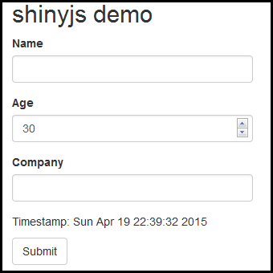

```{r setup, echo = FALSE, message = FALSE}
knitr::opts_chunk$set(tidy = FALSE, comment = "#>")
```

# shinyjs example app walk-through

This document provides a step-by-step guide on how to add a variety of shinyjs features to a simple app in order to make it more user friendly.

*You can view the final Shiny app developed in this simple example
[here](https://daattali.com/shiny/shinyjs-basic/).*

Suppose we want to have a simple Shiny app that collects a user's basic
information (name, age, company) and submits it, along with the time of
submission.  Here is a very simple implementation of such an app (nothing
actually happens when the user "submits").

```
library(shiny)
shinyApp(
  ui = fluidPage(
    div(id = "myapp",
      h2("shinyjs demo"),
      textInput("name", "Name", ""),
      numericInput("age", "Age", 30),
      textInput("company", "Company", ""),
      p("Timestamp: ", span(date())),
      actionButton("submit", "Submit")
    )
  ),
  
  server = function(input, output) {
  }
)
```

*Note that I generally don't like running Shiny apps like this and prefer to
declare the UI and server separately, but this style is used here for brevity.*

Here is what that app would look like



### Add shinyjs features

Now suppose we want to add a few features to the app to make it a bit more
user-friendly.  First we need to set up the app to use `shinyjs` by making a call to `useShinyjs()` in the Shiny app's UI.

Here are 7 features we'll add to the app, each followed with the code to
implement it using `shinyjs`:

**1. The "Name" field is mandatory and thus the "Submit" button should not be
enabled if there is no name**

In the server portion, add the following code

```
observe({
  if (is.null(input$name) || input$name == "") {
    shinyjs::disable("submit")
  } else {
    shinyjs::enable("submit")
  }
})
```

Or instead you can use the `toggleState` function and pass it a `condition`:

```
observe({
  shinyjs::toggleState("submit", !is.null(input$name) && input$name != "")
})
```

You can use the optional `condition` in some other functions as well, which
can be very useful to make your code shorter and more understandable.

**2. The "Age" and "Company" fields are optional and we want to have the ability
to hide that section of the form**

First, we need to section off the "Age" and "Company" elements into their own
section, so we surround them with a `div`

```
div(id = "advanced",
  numericInput("age", "Age", 30),
  textInput("company", "Company", "")
)
```

We also need to add a link in the UI that will be used to hide/show the section  

```
a(id = "toggleAdvanced", "Show/hide advanced info")
```

Lastly, we need to tell Shiny to show/hide the section when the link is clicked
by adding this code to the server

```
shinyjs::onclick("toggleAdvanced",
                  shinyjs::toggle(id = "advanced", anim = TRUE))
```

**3. Similarly, since we don't really care about "Age" and "Company" too much, we
want to hide them initially when the form loads**

Simply surround the section we want to hide initially with `shinyjs::hidden`

```
shinyjs::hidden(
  div(id = "advanced",
    ...
))
```

**4. The user should be able to update the "Timestamp" in case he spends way too
long filling out the form (not very realistic here, and the timestamp should
ideally be determined when the button is clicked, but it's good enough for
illustration purposes)**

First, we need to add an "Update" link to click on, and we need to give the
element showing the time an `id` so that we can refer to it later when we
want to change its contents.

To do that, replace `p("Timestamp: ", span(date()))` with  

```
p("Timestamp: ", span(id = "time", date()), a(id = "update", "Update"))
```

Now we need to tell Shiny what to do when "Update" is clicked by adding this
to the server

```
shinyjs::onclick("update", shinyjs::html("time", date()))
```

**5. Some users may find it hard to read the small text in the app, so there should
be an option to increase the font size**

First, we need to add checkbox to the UI

```
checkboxInput("big", "Bigger text", FALSE)
```

In order to make the text bigger, we will use CSS.  So let's add an appropriate
CSS rule by adding this code to the UI

```
shinyjs::inlineCSS(list(.big = "font-size: 2em"))
```

Lastly, we want the text to be big or small depending on whether the checkbox
is checked by adding this code to the server

```
observe({
  if (input$big) {
    shinyjs::addClass("myapp", "big")
  } else {
    shinyjs::removeClass("myapp", "big")
  }
})
```

Or, again, we can use the `toggleClass` function with the `condition` argument:

```
observe({
  shinyjs::toggleClass("myapp", "big", input$big)
})
```

**6. Give the user a "Thank you" message upon submission**

Simply add the following to the server

```
observeEvent(input$submit, {
  shinyjs::alert("Thank you!")
})
```

**7. Allow the user to reset the form**

First let's add a button to the UI

```
actionButton("reset", "Reset form")
```

And when the button is clicked, reset the form

```
observeEvent(input$reset, {
  shinyjs::reset("myapp")
})
```

### Final code

The final code looks like this

```
library(shiny)
shinyApp(
  ui = fluidPage(
    shinyjs::useShinyjs(),
    shinyjs::inlineCSS(list(.big = "font-size: 2em")),
    div(id = "myapp",
        h2("shinyjs demo"),
        checkboxInput("big", "Bigger text", FALSE),
        textInput("name", "Name", ""),
        a(id = "toggleAdvanced", "Show/hide advanced info", href = "#"),
        shinyjs::hidden(
          div(id = "advanced",
            numericInput("age", "Age", 30),
            textInput("company", "Company", "")
          )
        ),
        p("Timestamp: ",
          span(id = "time", date()),
          a(id = "update", "Update", href = "#")
        ),
        actionButton("submit", "Submit"),
        actionButton("reset", "Reset form")
    )
  ),
  
  server = function(input, output) {
    observe({
      shinyjs::toggleState("submit", !is.null(input$name) && input$name != "")
    })
    
    shinyjs::onclick("toggleAdvanced",
                     shinyjs::toggle(id = "advanced", anim = TRUE))    
    
    shinyjs::onclick("update", shinyjs::html("time", date()))
    
    observe({
      shinyjs::toggleClass("myapp", "big", input$big)
    })
    
    observeEvent(input$submit, {
      shinyjs::alert("Thank you!")
    })
    
    observeEvent(input$reset, {
      shinyjs::reset("myapp")
    })    
  }
)
```

You can view the final app [here](https://daattali.com/shiny/shinyjs-basic/).
