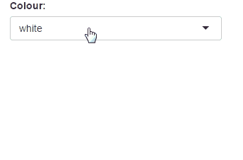

```{r setup, echo = FALSE, message = FALSE}
knitr::opts_chunk$set(tidy = FALSE, comment = "#>")
```

# extendShinyjs: Calling your own JavaScript functions from R

<h2 id="extendshinyjs-simple">Simple example</h2>

Using `extendShinyjs()` is simple and makes defining and calling JavaScript functions painless. Here is a very basic example of using `extendShinyjs()` to define a (fairly useless) function that changes the colour of the page.

```
library(shiny)
library(shinyjs)

jsCode <- "shinyjs.pageCol = function(params){$('body').css('background', params);}"

shinyApp(
  ui = fluidPage(
    useShinyjs(),
    extendShinyjs(text = jsCode, functions = c("pageCol")),
    selectInput("col", "Colour:",
                c("white", "yellow", "red", "blue", "purple"))
  ),
  server = function(input, output) {
    observeEvent(input$col, {
      js$pageCol(input$col)
    })
  }
)
```

Running the code above produces this shiny app:



See how easy that was? All I had to do was make the JavaScript function `shinyjs.pageCol`, pass the JavaScript code as an argument to `extendShinyjs()`, and then I can call `js$pageCol()`.

That's the basic idea: any JavaScript function named `shinyjs.foo` will be available to call as `js$foo()`. You can either pass the JS code as a string to the `text` argument, or place the JS code in a separate JavaScript file and use the `script` argument to specify where the code can be found. Using a separate file is generally preferred over writing the code inline, but in these examples I will always use the `text` argument to keep it simple.

> Note on using the `script` parameter: The script path is not necessarily a local path to the script file, rather it's a path that must be discoverable by the browser. It either needs to be a public URL, inside a `www` folder, or available via `addResourcePath()`.

<h2 id="extendshinyjs-onload">Running JavaScript code on page load</h2>

If there is any JavaScript code that you want to run immediately when the page loads rather than having to call it from the server, you can place it inside a `shinyjs.init` function. The function `shinyjs.init` will automatically be called when the Shiny app's HTML is initialized. A common use for this is when registering event handlers or initializing JavaScript objects, as these usually just need to run once when the page loads.

For example, the following example uses `shinyjs.init` to register an event
handler so that every keypress will print its corresponding key code:

```
jscode <- "
shinyjs.init = function() {
  $(document).keypress(function(e) { alert('Key pressed: ' + e.which); });
}"

shinyApp(
  ui = fluidPage(
    useShinyjs(),
    extendShinyjs(text = jscode, functions = c()),
    "Press any key"
  ),
  server = function(input, output) {}
)
```

<h2 id="extendshinyjs-args">Passing arguments from R to JavaScript</h2>

Any `shinyjs` function that is called will pass a single array-like parameter to its corresponding JavaScript function. If the function in R was called with unnamed arguments, then it will pass an Array of the arguments; if the R arguments are named then it will pass an Object with key-value pairs.

For example, calling `js$foo("bar", 5)` in R will call `shinyjs.foo(["bar", 5])` in JS, while calling `js$foo(num = 5, id = "bar")` in R will call `shinyjs.foo({num : 5, id : "bar"})` in JS. This means that the `shinyjs.foo` function needs to be able to deal with both types of parameters.

To assist in normalizing the parameters, `shinyjs` provides a `shinyjs.getParams()` function which serves two purposes. First of all, it ensures that all arguments are named (even if the R function was called without names). Secondly, it allows you to define default values for arguments.

Here is an example of a JS function that changes the background colour of an element and uses `shinyjs.getParams()`.

```
shinyjs.backgroundCol = function(params) {
  var defaultParams = {
    id : null,
    col : "red"
  };
  params = shinyjs.getParams(params, defaultParams);

  var el = $("#" + params.id);
  el.css("background-color", params.col);
}
```

Note the `defaultParams` that we defined and the call to `shinyjs.getParams`. It ensures that calling `js$backgroundCol("test", "blue")` and `js$backgroundCol(id = "test", col = "blue")` and `js$backgroundCol(col = "blue", id = "test")` are all equivalent, and that if the colour parameter is not provided then "red" will be the default.

All the functions provided in `shinyjs` make use of `shinyjs.getParams`, and it is highly recommended to always use it in your functions as well. Notice that the order of the arguments in `defaultParams` in the JavaScript function matches the order of the arguments when calling the function in R with unnamed arguments.

For completeness, here is the code for a shiny app that uses the above function (it's not a very practical example, but it's great for showing how to use `extendShinyjs` with parameters):

```
library(shiny)
library(shinyjs)

jsCode <- '
shinyjs.backgroundCol = function(params) {
  var defaultParams = {
    id : null,
    col : "red"
  };
  params = shinyjs.getParams(params, defaultParams);

  var el = $("#" + params.id);
  el.css("background-color", params.col);
}'

shinyApp(
  ui = fluidPage(
    useShinyjs(),
    extendShinyjs(text = jsCode, functions = c("backgroundCol")),
    p(id = "name", "My name is Dean"),
    p(id = "sport", "I like soccer"),
    selectInput("col", "Colour",
                c("green", "yellow", "red", "blue", "white")),
    selectInput("selector", "Element", c("sport", "name", "button")),
    actionButton("button", "Go")
  ),
  server = function(input, output) {
    observeEvent(input$button, {
      js$backgroundCol(input$selector, input$col)
    })
  }
)
```

And the resulting app:


Note that I chose to define the JS code as a string for illustration purposes, but in reality I would prefer to place the code in a separate file and use the `script` argument instead of `text`.
