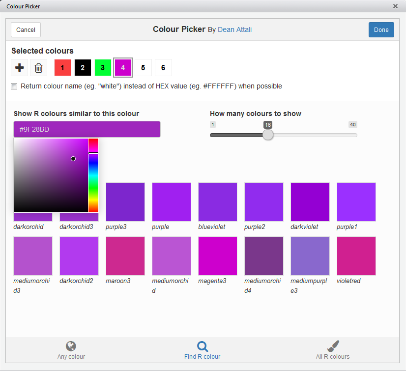

```{r setup, echo = FALSE, message = FALSE}
knitr::opts_chunk$set(tidy = FALSE, comment = "#>")
```

# shinyjs - Easily improve the user interaction and user experience in your Shiny apps in seconds

[](https://travis-ci.org/daattali/shinyjs)
[](https://cran.r-project.org/package=shinyjs)

> *Copyright 2016 [Dean Attali](http://deanattali.com). Licensed under the MIT license.*

`shinyjs` lets you perform common useful JavaScript operations in Shiny 
apps that will greatly improve your apps without having to know any JavaScript.

Examples include: hiding an element, disabling an input, resetting an input back to its original value, delaying code execution by a few seconds, and many more useful functions for both the end user and the developer. `shinyjs` can also be used to easily call your own custom JavaScript functions from R.

# Table of contents

- [Demos and tutorials](#demos)
- [Installation](#install)
- [Overview of main functions](#overview-main)
- [How to use](#usage)
- [Basic use case - complete working example](#usecase)
- [Calling your own JavaScript functions from R](#extendshinyjs)
- [FAQ and extra tricks](#faq-tricks)
- [Colour Picker input & addin](#colourpicker)
- [More resources](#more-resources)

<h2 id="demos">Demos and tutorials</h2>

- [Demo Shiny app](http://daattali.com/shiny/shinyjs-demo/) that lets
you play around with some of the functionality in `shinyjs`.
- [Video of my shinyjs talk](http://deanattali.com/shinyjs-shinydevcon-2016/) (30 min) and the corresponding [presentation slides](http://bit.ly/shinyjs-slides) from the 2016 Shiny Developer Conference.
- [Video of my shinyjs talk](http://deanattali.com/shinyjs-user-2016/) (5 min) and the corresponding [presentation slides](http://bit.ly/shinyjs-slides-useR2016) from the 2016 useR Conference.

<h2 id="install">Installation</h2>

To install the stable CRAN version:

```
install.packages("shinyjs")
```

To install the latest development version from GitHub:

```
install.packages("devtools")
devtools::install_github("daattali/shinyjs")
```

<h2 id="overview-main">Overview of main functions</h2>

**Note: In order to use any `shinyjs` function in a Shiny app, you must first call `useShinyjs()` anywhere in the app's UI.**

| Function | Description |
|---------------------|----------------------------------------------------|
| `show`/`hide`/`toggle` | Display or hide an element (optionally with an animation). |
| `hidden` | Initialize a Shiny tag as invisible (can be shown later with a call to `show`). |
| `enable`/`disable`/`toggleState` | Enable or disable an input element, such as a button or a text input. |
| `disabled` | Initialize a Shiny input as disabled. |
| `reset` | Reset a Shiny input widget back to its original value. |
| `delay` | Execute R code (including any `shinyjs` functions) after a specified amount of time. |
| `alert` | Show a message to the  |
| `html` | Change the text/HTML of an element. |
| `onclick` | Run R code when a specific element is clicked. Was originally developed with the sole purpose of running a `shinyjs` function when an element is clicked, though any R code can be used. |
| `onevent` | Similar to `onclick`, but can be used with many other events instead of click (for example, listen for a key press, mouse hover, etc). |
| `addClass`/`removeClass`/`toggleClass` | add or remove a CSS class from an element. |
| `runjs` | Run arbitrary JavaScript code. |
| `extendShinyjs` | Allows you to write your own JavaScript functions and use `shinyjs` to call them as if they were regular R code. More information is available in the section "Calling your own JavaScript functions from R" below. |

### Functions that help you during Shiny app development

| Function | Description |
|---------------------|----------------------------------------------------|
| `runcodeUI`+`runcodeServer` | Adds a text input to your app that lets you run arbitrary R code live. |
| `showLog` | Print any JavaScript `console.log()` messages in the R console, to make it easier and quicker to debug apps without having to open the JS console. |
| `logjs` | Print a message to the JavaScript console (mainly used for debugging purposes). |
| `inlineCSS` | Easily add inline CSS to a Shiny app. |

[Check out the shinyjs demo app](http://daattali.com/shiny/shinyjs-demo/) to see
some of these in action, or install `shinyjs` and run `shinyjs::runExample()`
to see more demos.

<h2 id="usage">How to use</h2>

A typical Shiny app has a UI portion and a server portion. Before using most shinyjs functions, you need to call `useShinyjs()` in the app's UI. It's best to include it near the top as a convention.

Here is a minimal Shiny app that uses `shinyjs`:

```
library(shiny)
library(shinyjs)

ui <- fluidPage(
  useShinyjs(),  # Include shinyjs

  actionButton("button", "Click me"),
  textInput("text", "Text")
)

server <- function(input, output) {
  observeEvent(input$button, {
    toggle("text")  # toggle is a shinyjs function
  })
}

shinyApp(ui, server)
```

This is how most Shiny apps should initialize `shinyjs` - by calling `useShinyjs()` near the top of the UI.

However, if you use shinyjs in any of the following cases:

- In Shiny dashboards (built using the `shinydashboard` package)
- In Shiny apps that use a `navbarPage` layout
- In interactive Rmd documents
- In Shiny apps that manually build the user interface with an HTML file or template (instead of using Shiny's UI functions)

Then you should see the [*Including shinyjs in different types of apps*](./shinyjs-usage.Rmd) document.

If your Shiny app doesn't fall into any of these categories, then the above code sample should be enough to get your started with including shinyjs in your app.

<h2 id="usecase">Basic use case - complete working example</h2>

See the [*shinyjs example app walk-through*](./shinyjs-example.Rmd) document for a step-by-step guide on how to add a variety of shinyjs features to a simple app in order to make it more user friendly.

<h2 id="extendshinyjs">Calling your own JavaScript functions from R</h2>

You can also use `shinyjs` to add your own JavaScript functions that can be called from R as if they were regular R functions using `extendShinyjs`. This is only suitable for advanced users who are familiar with JavaScript and wish to facilitate the communication between R and JavaScript.

To learn about this feature and see how useful it can be, see the [*extendShinyjs: Calling your own JavaScript functions from R*](./shinyjs-extend.Rmd) document.

<h2 id="faq-tricks">FAQ and extra tricks</h2>

There are several questions that pop up very frequently in my email or on StackOverflow about "How do I use shinyjs to do \_\_\_?" Here is a list of a few of these common questions with links to a solution that could be useful.  Note that all of these require using `extendShinyjs()`.

- [How do I show/hide the `shinydashboard` sidebar programmatically?](http://stackoverflow.com/a/31306707/3943160)
- [How do I hide/disable a tab?](http://stackoverflow.com/a/31719425/3943160)
- [How do I refresh the page?](http://stackoverflow.com/a/34758024/3943160)
- [How do I call a JavaScript function from a different JavaScript library?](https://github.com/timelyportfolio/sweetalertR/issues/1#issuecomment-151685005)
- [How do I change the values of a `sliderInput`?](http://stackoverflow.com/a/31066997/3943160)
- [How do I call JavaScript code and use the return value?](http://stackoverflow.com/a/34728125/3943160)

<h2 id="colourpicker">Colour Picker input & addin</h2>

**NOTE: As of August 2016, the colour picker functions are deprecated and have moved into a separate package [`colourpicker`](https://github.com/daattali/colourpicker). Please use the `colourpicker` package instead of `shinyjs` in the future.**

`shinyjs` has a `colourInput()` function that lets you add a colour picker widget to Shiny apps.  There is also a colour picker RStudio addin (accessed through the *Addins* menu) and a gadget (accessed with the `colourPicker()` function) that can be used to easily select colours.  The screenshot below is from the colour picker addin. You can also view a [short GIF demo](../inst/img/colourPickerGadget.gif) of the addin.



<h2 id="more-resources">More resources</h2>

This document is meant to serve as a high overview of shinyjs. There are three more documents provided in shinyjs to teach you various aspects of the package:

- [Including shinyjs in different types of apps](./shinyjs-usage.Rmd)
- [shinyjs example app walk-through](./shinyjs-example.Rmd)
- [extendShinyjs: Calling your own JavaScript functions from R](./shinyjs-extend.Rmd)

If you need help, I strongly suggest browsing the [shinyjs tag](http://stackoverflow.com/questions/tagged/shinyjs) on StackOverflow or asking your own question there. Of course you can also email me directly if you're in desperate need of help, or [open an issue](https://github.com/daattali/shinyjs/issues) for bugs.

## Motivation & alternatives using native Shiny

The initial release of this package was announced [on my blog](http://deanattali.com/2015/04/23/shinyjs-r-package/)
and discusses these topics.

## Contributions

If you have any suggestions or feedback, I would love to hear about it. You can either [message me directly](http://deanattali.com/aboutme#contact), [open an issue](https://github.com/daattali/shinyjs/issues) if you want to request a feature/report a bug, or make a pull request if you can contribute.

I'd like to give special thanks to the Shiny developers, especially [Joe Cheng](http://www.joecheng.com/) for always answering all my Shiny questions.

Lastly, if you find shinyjs useful, please consider [supporting me](https://www.paypal.me/daattali/15) for the countless hours I've spent building, documenting, and supporting this package :)
