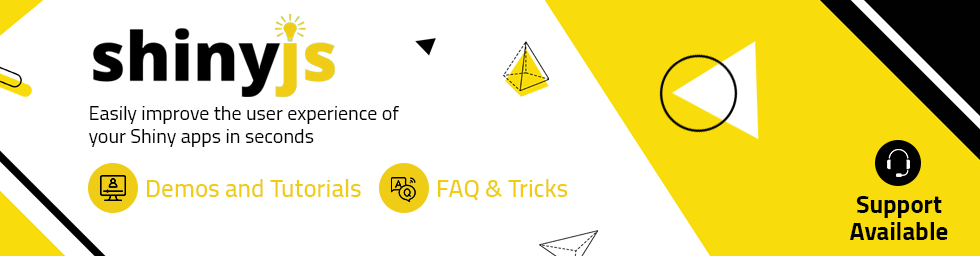

```{r setup, echo = FALSE, message = FALSE}
knitr::opts_chunk$set(tidy = FALSE, comment = "#>")
```

[](https://deanattali.com/shinyjs/)

<h3 align="center">shinyjs</h3>

<h4 align="center">Easily improve the user experience of your Shiny apps in seconds
<br><br>
<a href="https://deanattali.com/shinyjs/">Official website</a>
&middot;
by <a href="https://deanattali.com">Dean Attali</a>
</h4>

<p align="center">
<a href="https://xscode.com/daattali/shinyjs">

</a>
<a href="https://travis-ci.org/daattali/shinyjs">

</a>
<a href="https://cran.r-project.org/package=shinyjs">

</a>
</p>

</p>

---

{shinyjs} lets you perform common useful JavaScript operations in Shiny 
apps that will greatly improve your apps without having to know any JavaScript.

Examples include: hiding an element, disabling an input, resetting an input back to its original value, delaying code execution by a few seconds, and many more useful functions for both the end user and the developer. {shinyjs} can also be used to easily call your own custom JavaScript functions from R.

**Need Shiny help? [I'm available for consulting](https://attalitech.com/).**<br/>
**If you find {shinyjs} useful, please consider [supporting my work](https://github.com/sponsors/daattali) to unlock rewards\! ❤**

<p align="center">

<a style="display: inline-block; margin-left: 10px;" href="https://github.com/sponsors/daattali">
 </a>

<a style="display: inline-block;" href="https://paypal.me/daattali">

</a>

</p>

# Table of contents

- [Demos and tutorials](#demos)
- [Overview of main functions](#overview-main)
- [Installation](#install)
- [How to use](#usage)
- [Basic use case - complete working example](#usecase)
- [Calling your own JavaScript functions from R](#extendshinyjs)
- [FAQ and extra tricks](#faq-tricks)
- [Support](#support)
- [Sponsors 🏆](#sponsors)

<h2 id="demos">Demos and tutorials</h2>

- [Demo Shiny app](https://deanattali.com/shinyjs/demo) that lets
you play around with some of the functionality in {shinyjs}.
- [Video of my {shinyjs} talk](https://deanattali.com/shinyjs-shinydevcon-2016/) (30 min) and the corresponding [presentation slides](https://bit.ly/shinyjs-slides) from the 2016 Shiny Developer Conference.
- [Video of my {shinyjs} talk](https://deanattali.com/shinyjs-user-2016/) (5 min) and the corresponding [presentation slides](https://bit.ly/shinyjs-slides-useR2016) from the 2016 useR Conference.

<h2 id="overview-main">Overview of main functions</h2>

**Note: In order to use any {shinyjs} function in a Shiny app, you must first call `useShinyjs()` anywhere in the app's UI.**

| Function | Description |
|---------------------|----------------------------------------------------|
| `show`/`hide`/`toggle` | Display or hide an element (optionally with an animation). |
| `hidden` | Initialize a Shiny tag as invisible (can be shown later with a call to `show`). |
| `enable`/`disable`/`toggleState` | Enable or disable an input element, such as a button or a text input. |
| `disabled` | Initialize a Shiny input as disabled. |
| `reset` | Reset a Shiny input widget back to its original value. |
| `refresh` | Refresh the page. |
| `delay` | Execute R code (including any {shinyjs} functions) after a specified amount of time. |
| `alert` | Show a message to the user. |
| `click` | Simulate a click on a button. |
| `html` | Change the text/HTML of an element. |
| `onclick` | Run R code when a specific element is clicked. Was originally developed with the sole purpose of running a {shinyjs} function when an element is clicked, though any R code can be used. |
| `onevent` | Similar to `onclick`, but can be used with many other events instead of click (for example, listen for a key press, mouse hover, etc). |
| `addClass`/`removeClass`/`toggleClass` | add or remove a CSS class from an element. |
| `runjs` | Run arbitrary JavaScript code. |
| `extendShinyjs` | Allows you to write your own JavaScript functions and use {shinyjs} to call them as if they were regular R code. More information is available in the section "Calling your own JavaScript functions from R" below. |

### Functions that help you during Shiny app development

| Function | Description |
|---------------------|----------------------------------------------------|
| `runcodeUI`+`runcodeServer` | Adds a text input to your app that lets you run arbitrary R code live. |
| `showLog` | Print any JavaScript `console.log()` messages in the R console, to make it easier and quicker to debug apps without having to open the JS console. |
| `logjs` | Print a message to the JavaScript console (mainly used for debugging purposes). |
| `inlineCSS` | Easily add inline CSS to a Shiny app. |

[Check out the {shinyjs} demo app](https://deanattali.com/shinyjs/demo) to see
some of these in action, or install {shinyjs} and run `shinyjs::runExample()`
to see more demos.

<h2 id="install">Installation</h2>

To install the stable CRAN version:

```
install.packages("shinyjs")
```

To install the latest development version from GitHub:

```
install.packages("remotes")
remotes::install_github("daattali/shinyjs")
```

<h2 id="usage">How to use</h2>

A typical Shiny app has a UI portion and a server portion. Before using most {shinyjs} functions, you need to call `useShinyjs()` in the app's UI. It's best to include it near the top as a convention.

Here is a minimal Shiny app that uses {shinyjs}:

```
library(shiny)
library(shinyjs)

ui <- fluidPage(
  useShinyjs(),  # Include shinyjs

  actionButton("button", "Click me"),
  textInput("text", "Text")
)

server <- function(input, output) {
  observeEvent(input$button, {
    toggle("text")  # toggle is a shinyjs function
  })
}

shinyApp(ui, server)
```

This is how most Shiny apps should initialize {shinyjs} - by calling `useShinyjs()` near the top of the UI.

However, if you use {shinyjs} in any of the following cases:

- In Shiny dashboards (built using the `shinydashboard` package)
- In Shiny apps that use a `navbarPage` layout
- In Rmd documents
- In Shiny apps that manually build the user interface with an HTML file or template (instead of using Shiny's UI functions)

Then you should see the [*Including {shinyjs} in different types of apps*](https://deanattali.com/shinyjs/advanced) document.

If your Shiny app doesn't fall into any of these categories, then the above code sample should be enough to get your started with including {shinyjs} in your app.

<h2 id="usecase">Basic use case - complete working example</h2>

See the [*{shinyjs} example app walk-through*](https://deanattali.com/shinyjs/example) document for a step-by-step guide on how to add a variety of {shinyjs} features to a simple app in order to make it more user friendly.

<h2 id="extendshinyjs">Calling your own JavaScript functions from R</h2>

You can also use {shinyjs} to add your own JavaScript functions that can be called from R as if they were regular R functions using `extendShinyjs()`. This is only suitable for advanced users who are familiar with JavaScript and wish to facilitate the communication between R and JavaScript.

To learn about this feature and see how useful it can be, see the [*extendShinyjs: Calling your own JavaScript functions from R*](https://deanattali.com/shinyjs/extend) document.

<h2 id="faq-tricks">FAQ and extra tricks</h2>

There are several questions that pop up very frequently in my email or on StackOverflow about "How do I use {shinyjs} to do \_\_\_?" Here is a list of a few of these common questions with links to a solution that could be useful.  Note that all of these require using `extendShinyjs()`.

- [How do I show/hide the `shinydashboard` sidebar programmatically?](https://stackoverflow.com/a/31306707/3943160)
- [How do I hide/disable a tab?](https://stackoverflow.com/a/31719425/3943160)
- [How do I refresh the page?](https://stackoverflow.com/a/34758024/3943160)
- [How do I call a JavaScript function from a different JavaScript library?](https://github.com/timelyportfolio/sweetalertR/issues/1#issuecomment-151685005)
- [How do I change the values of a `sliderInput`?](https://stackoverflow.com/a/31066997/3943160)
- [How do I call JavaScript code and use the return value?](https://stackoverflow.com/a/34728125/3943160)

I also keep a long [list of various Shiny tips & tricks](https://deanattali.com/blog/advanced-shiny-tips/) for solving common Shiny problems, many of which make use of {shinyjs}.

<h2 id="support">Support</h2>

This document is only an overview of {shinyjs}. There are more in-depth resources available on the [{shinyjs} website](https://deanattali.com/shinyjs/).

If you need help with {shinyjs}, free support is available on [StackOverflow](https://stackoverflow.com/questions/ask?tags=r+shiny+shinyjs), [RStudio Community](https://community.rstudio.com/new-topic?category=shiny&tags=shinyjs), and [Twitter](https://twitter.com/hashtag/rstats). 

**Due to the large volume of requests I receive, I'm unable to provide free support. If you can't solve any issue and require my personal help, please visit https://xscode.com/daattali/shinyjs or [contact me](https://attalitech.com/contact).**

<h2 id="sponsors">Sponsors 🏆</h2>

> There are no sponsors yet

[Become the first sponsor for {shinyjs} and unlock special rewards!](https://github.com/sponsors/daattali/sponsorships?tier_id=39856)